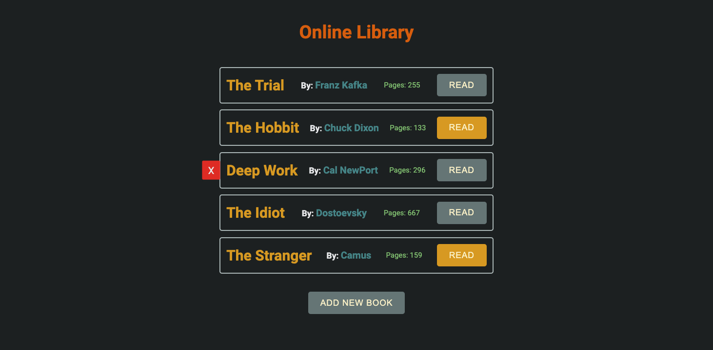

# library

Online library for reading books

### What I have learned from this project?

- Practice more with the DOM
- Dealing with Objects
- Creating instances from constructor dynamically

### Acknowledgement

- [TOP](https://www.theodinproject.com/lessons/node-path-javascript-library)
